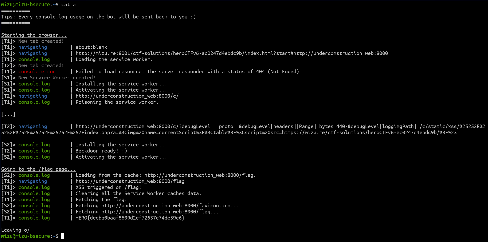

<p align="center">
    <br>
    A hardened, easy-to-debug client-side CTF challenge bot template.
    <br>
    <a href="https://twitter.com/intent/follow?screen_name=kevin_mizu" title="Follow"></a>
    <br>
</p>

## 📦 Installation

```bash
git clone git@github.com:kevin-mizu/bot-ctf-template.git
# Update the ./src/bot.js file with you challenge logic
docker compose up --build -d
```

## 🌟 Features

- [x] TCP-only usage: `echo https://example.com | nc localhost 55555`.
- [x] All logged messages (DOM events, service worker activity, extensions...), along with navigation info, are piped through the socket.
- [x] Hardened Docker setup: `low-privilege user`, `read-only`, `cap_drop`, `restricted tmpfs`, etc.
- [x] Chromium process is cleared every minute to avoid shadow execution (e.g., if the script crashes).
- [x] Customizable hardening to prevent cross-challenge cheesing (e.g., using [--proxy-pac-url](https://www.chromium.org/developers/design-documents/network-settings/)).
- [x] Limited number of tabs (default is 5).

**Warning!** If you want to use this bot for a challenge that requires leaking something through the URL (or any XSLeak challenge), I recommend only piping `console.log` output!

## ❓ Why creating it?

My main motivation for creating this bot is to provide:

- For challenge makers:
  * A quick way to set up a hardened bot, without digging through past CTF examples.
  * A way to have a one-liner solver, making it easier to test the challenge before or during the CTF (especially useful if the challenge author isn't available).
  * A way to relay information to players about what's happening remotely. For example, in a multi-step challenge involving a service worker, logging each time the service worker cache is triggered can help users verify that everything is working correctly (and prevent those hard-to-debug support tickets :p).

- For CTF players:
  * A way to debug why a solution isn't working remotely using console.log. No more spamming webhooks with 985,564 fetches.
  * Just like for challenge makers, an easy way to share solutions after the CTF ([example](https://mizu.re/post/fcsc-2025-writeups#dom-monitor-part1-solution-script)).

I've already used this template in several CTFs ([HeroCTF v6](https://github.com/HeroCTF/HeroCTF_v6), [FCSC 2025](https://hackropole.fr/)...) and received great feedback, so I thought it was worth sharing :)

## 📝 Usage example

To use it, all you need to do is customize the `/* ** CHALLENGE LOGIC ** */` section in the [/src/bot.js](./src/bot.js) file. For example, if the goal of the challenge is to steal a cookie, you would add:

```js
await page.setCookie({
    name: "flag",
    value: "FCSC{FAKE_FLAG}",
    domain: "challenge-domain.com",
    path: "/",
    httpOnly: true,
    secure: true,
});
```

Then, after running it, here's an example of the output you might get (taken from the "[Under Construction](https://mizu.re/post/heroctf-v6-writeups#underConstruction-gadget-cacheapi)" challenge → [HeroCTF v6](https://github.com/HeroCTF/HeroCTF_v6)):



## 🔒 Restricting domains

As mentioned in the great "[Secret Web Hacking Knowledge: CTF Authors Hate These Simple Tricks](https://www.youtube.com/watch?v=Sm4G6cAHjWM)" talk by [@pilvar222](https://x.com/pilvar222), client-side challenges have often been bypassed using other challenge domains. One way to prevent this from the bot's side is by blocking access to any other challenge domains.

On the bot, this is done using the [--proxy-pac-url](https://www.chromium.org/developers/design-documents/network-settings/) Chromium flag, which allows each request to be handled and proxied (or not) based on the return value.

For instance, the following configuration only allows the bot to access the `challenge-name.fcsc.fr` subdomain. All other `.fcsc.fr` domains are proxied to `127.0.0.1:1`, effectively blocking the requests.

```js
function FindProxyForURL (url, host) {
	if (host == "challenge-name.fcsc.fr") return "DIRECT";
	if (host.endsWith(".fcsc.fr")) return "PROXY 127.0.0.1:1";
	return "DIRECT";
}
```

*This technique is inspired by a bot I saw in a CTF, but I can't remember which one... If the author of this trick sees this, don't hesitate to contact me, I'll credit you as soon as I can :D*

## 🤝 Contributors

[@cryptanalyse](https://x.com/cryptanalyse), and maybe you?
